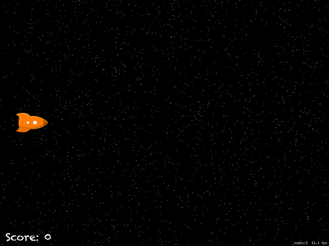

# Space: the final frontier

<!-- YOUTUBE: wT8EGUiUGPc -->

To begin with we're going to place a handful of things that are required to make our game work: a star field (not a static background picture this time), the player image, plus a score label. Those three things will use an `SKEmitterNode`, an `SKSpriteNode` and an `SKLabelNode` respectively, so let's declare them as properties now:

    var starfield: SKEmitterNode!
    var player: SKSpriteNode!

    var scoreLabel: SKLabelNode!
    var score = 0 {
        didSet {
            scoreLabel.text = "Score: \(score)"
        }
    }

As per usual, we're using a property observer to update the score label as needed.

In order to get those properties set up with meaningful values, we're going to put a lot of code into `didMove(to:)` so that everything is created and positioned up front.

I'm not going to bore you by going through every line of code – three quarters of it you should know by heart at this point! – but I do want to point out a few interesting things.

First, the star field particle emitter is positioned at X:1024 Y:384, which is the right edge of the screen and half way up. If you created particles like this normally it would look strange, because most of the screen wouldn't start with particles and they would just stream in from the right. But by using the `advanceSimulationTime()` method of the emitter we’re going to ask SpriteKit to simulate 10 seconds passing in the emitter, thus updating all the particles as if they were created 10 seconds ago. This will have the effect of filling our screen with star particles.

Second, because the spaceship is an irregular shape and the objects in space are also irregular, we're going to use per-pixel collision detection. This means collisions happen not based on rectangles and circles but based on actual pixels from one object touching actual pixels in another.

Now, SpriteKit does a really great job of optimizing this so that it looks like it's using actual pixels when in fact it just uses a very close approximation, but you should still only use it when it's needed. If something can be created as a rectangle or a circle you should do so because it's much faster.

Third, we're going to set the contact test bit mask for our player to be 1. This will match the category bit mask we will set for space debris later on, and it means that we'll be notified when the player collides with debris.

Fourth, I'm going to set the gravity of our physics world to be empty, because this is space and there isn't any gravity. Well, that's not strictly true because there is a small amount of gravity everywhere in space, but certainly nothing we can simulate effectively in this game!

Here's the new `didMove(to:)` method:

    override func didMove(to view: SKView) {
        backgroundColor = .black

        starfield = SKEmitterNode(fileNamed: "starfield")!
        starfield.position = CGPoint(x: 1024, y: 384)
        starfield.advanceSimulationTime(10)
        addChild(starfield)
        starfield.zPosition = -1

        player = SKSpriteNode(imageNamed: "player")
        player.position = CGPoint(x: 100, y: 384)
        player.physicsBody = SKPhysicsBody(texture: player.texture!, size: player.size)
        player.physicsBody?.contactTestBitMask = 1
        addChild(player)

        scoreLabel = SKLabelNode(fontNamed: "Chalkduster")
        scoreLabel.position = CGPoint(x: 16, y: 16)
        scoreLabel.horizontalAlignmentMode = .left
        addChild(scoreLabel)

        score = 0

        physicsWorld.gravity = CGVector(dx: 0, dy: 0)
        physicsWorld.contactDelegate = self
    }

Did you see how easy it is to make per-pixel collision detection work? You just need to create the `SKPhysicsBody` by passing in a texture and size, and for us we just want to use the player's current texture and size. That's it!

The last line of code in that method sets our current game scene to be the contact delegate of the physics world, so you'll need to conform to the `SKPhysicsContactDelegate` protocol.

