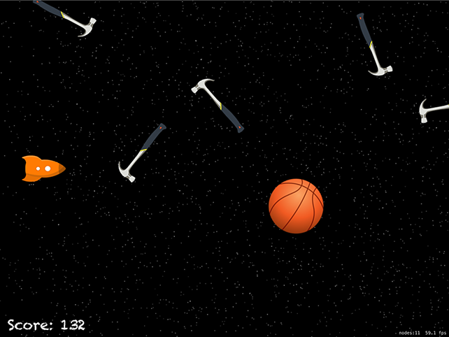

# Bring on the enemies: Timer, linearDamping, angularDamping

<!-- YOUTUBE: NIRrPs2fpPw -->

The point of our game is for the spaceship to survive while random "space debris" gets thrown at it. I've included three items of various shapes in this example, but you can add more easily enough. As long as the player stays alive their score ticks upwards, so clearly it's going to take some quick movement to get the highest score.

To add enemies and time to the game, we need to declare three new properties:

    let possibleEnemies = ["ball", "hammer", "tv"]
    var isGameOver = false
    var gameTimer: Timer?

The `possibleEnemies` array contains the names of the three images that can be used as space debris in the game: a ball, a hammer and a TV. The `isGameOver` is a simple boolean that will be set to true when we should stop increasing the player's score.

The third property is a new type, called `Timer`. This is responsible for running code after a period of time has passed, either once or repeatedly. 

When you create an `Timer` you specify five parameters: how many seconds you want the delay to be, what object should be told when the timer fires, what method should be called on that object when the timer fires, any context you want to provide, and whether the time should repeat.

We need to create a new enemy on a regular basis, so the first thing to do is create a scheduled timer. I'm going to give it a timer interval of 0.35 seconds, so it will create about three enemies a second. Put this code into `didMove(to:)`:

    gameTimer = Timer.scheduledTimer(timeInterval: 0.35, target: self, selector: #selector(createEnemy), userInfo: nil, repeats: true)

**Tip:** The `scheduledTimer()` timer not only creates a timer, but also starts it immediately.

Creating an enemy needs to use techniques that you've mostly seen already: it will shuffle the `possibleEnemies` array, create a sprite node using the first item in that array, position it off the right edge and with a random vertical position, then add it to the scene.

That part is old. The new part is the way we're going to create the physics body of the debris: we're going to use per-pixel collision again, tell it to collide with the player, make it move to the left at a fast speed, and give it some angular velocity. But we're also going to set to 0 its `linearDamping` and `angularDamping` properties, which means its movement and rotation will never slow down over time. Perfect for a frictionless space environment!

Add this `createEnemy()` method:

    @objc func createEnemy() {
        guard let enemy = possibleEnemies.randomElement() else { return }

        let sprite = SKSpriteNode(imageNamed: enemy)
        sprite.position = CGPoint(x: 1200, y: Int.random(in: 50...736))
        addChild(sprite)

        sprite.physicsBody = SKPhysicsBody(texture: sprite.texture!, size: sprite.size)
        sprite.physicsBody?.categoryBitMask = 1
        sprite.physicsBody?.velocity = CGVector(dx: -500, dy: 0)
        sprite.physicsBody?.angularVelocity = 5
        sprite.physicsBody?.linearDamping = 0
        sprite.physicsBody?.angularDamping = 0
    }

Now that lots of debris will appear, we need to make sure we remove their nodes once they are invisible. In this game, that means removing nodes from the scene once they are effectively useless because they have passed the player. This will be done using a check in the `update()` method: if any node is beyond X position -300, we'll consider it dead.

The `update()` method is also a good place to make our score increment all the time. All we need to do is check whether `isGameOver` is still false, and add one to the score if so. Here's the code for the `update()` method:

    override func update(_ currentTime: TimeInterval) {
        for node in children {
            if node.position.x < -300 {
                node.removeFromParent()
            }
        }

        if !isGameOver {
            score += 1
        }
    }

