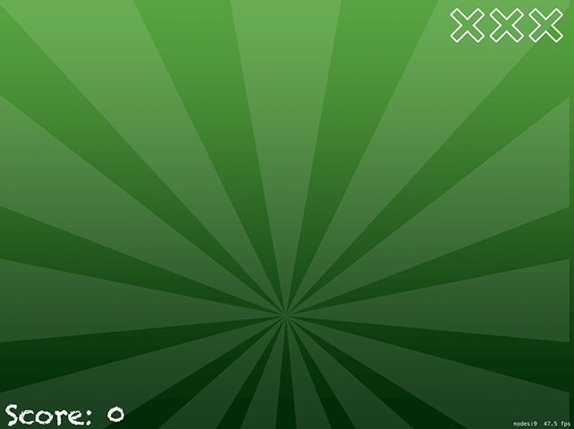

# Basics quick start: SKShapeNode

<!-- YOUTUBE: CK9OwMyJQDY -->

The only way we can get through this project with our sanity intact is by whizzing through the things you know already so I can spend more time focusing on the new bits. So, be prepared for abrupt changes of pace: fast, slow, fast, slow, as appropriate.

Open up GameScene.swift and put this into `didMove(to:)`:

    let background = SKSpriteNode(imageNamed: "sliceBackground")
    background.position = CGPoint(x: 512, y: 384)
    background.blendMode = .replace
    background.zPosition = -1
    addChild(background)

    physicsWorld.gravity = CGVector(dx: 0, dy: -6)
    physicsWorld.speed = 0.85

    createScore()
    createLives()
    createSlices()

The last three are all methods we'll create in a moment, but first there are two new lines in there. The default gravity of our physics world is -0.98, which is roughly equivalent to Earth's gravity. I'm using a slightly lower value so that items stay up in the air a bit longer.

I'm also telling the physics world to adjust its speed downwards, which causes all movement to happen at a slightly slower rate.

The first two new methods are easy and require little explanation, but you will need to add some properties to the `GameScene` class to support them:

    var gameScore: SKLabelNode! 
    var score = 0 {
        didSet {
            gameScore.text = "Score: \(score)"
        }
    }

    var livesImages = [SKSpriteNode]()
    var lives = 3

That's all old news for you – if nothing else, this should show how far you've come! Now here are the two new methods:

    func createScore() {
        gameScore = SKLabelNode(fontNamed: "Chalkduster")
        gameScore.horizontalAlignmentMode = .left
        gameScore.fontSize = 48
        addChild(gameScore)

        gameScore.position = CGPoint(x: 8, y: 8)
        score = 0 
    }

    func createLives() {
        for i in 0 ..< 3 {
            let spriteNode = SKSpriteNode(imageNamed: "sliceLife")
            spriteNode.position = CGPoint(x: CGFloat(834 + (i * 70)), y: 720)
            addChild(spriteNode)

            livesImages.append(spriteNode)
        }
    }

You'll notice I'm adding the lives images to the `livesImages` array, which is done so that we can cross off lives when the player loses.

That leaves the `createSlices()` method, and this bit *is* new. In this game, swiping around the screen will lead a glowing trail of slice marks that fade away when you let go or keep on moving. To make this work, we're going to do three things:

1.  Track all player moves on the screen, recording an array of all their swipe points.
2.  Draw two slice shapes, one in white and one in yellow to make it look like there's a hot glow.
3.  Use the `zPosition` property to make sure the slices go above everything else in the game.

Drawing a shape in SpriteKit is easy thanks to a special node type called `SKShapeNode`. This lets you define any kind of shape you can draw, along with line width, stroke color and more, and it will render it to the screen. We're going to draw two lines – one for a yellow glow, and one for a white glow in the middle of the yellow glow – so we're going to need two `SKShapeNode` properties:

    var activeSliceBG: SKShapeNode!
    var activeSliceFG: SKShapeNode!

And here's the code for the `createSlices()` method:

    func createSlices() {
        activeSliceBG = SKShapeNode()
        activeSliceBG.zPosition = 2

        activeSliceFG = SKShapeNode()
        activeSliceFG.zPosition = 3

        activeSliceBG.strokeColor = UIColor(red: 1, green: 0.9, blue: 0, alpha: 1)
        activeSliceBG.lineWidth = 9

        activeSliceFG.strokeColor = UIColor.white
        activeSliceFG.lineWidth = 5

        addChild(activeSliceBG)
        addChild(activeSliceFG)
    }

Note that the background slice has a thicker line width than the foreground, and has a higher Z position than the background slice. I'm using Z positions 2 and 3 for the slice shapes, because I'll be using Z position 1 for bombs and Z position 0 for everything else – this ensures the slice shapes are on top, then bombs, then everything else.
