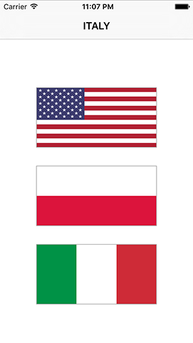

# Adivinha a bandeira : números aleatórios

<!-- YOUTUBE: A9SKgYhqZ_Q -->

O nosso código atual escolhe os primeiros três itens do array de países, e coloca-os nos três botões do nosso *view controller*. Para começar isto era suficiente, mas necessitamos de escolher de cada vez novos países de forma aleatória. Há duas formas de fazer isto:

1. Escolher três números aleatórios e usá-los para retirar do array três bandeiras.
2. Baralhar a ordem do array, e depois selecionar os três primeiros itens. 

Ambas as abordagens são válidas, mas a primeira requer mais trabalho do que a segunda  porque temos de assegurar que os três números são diferentes - este jogo não seria nada divertido se as três bandeiras fossem a mesma!

A segunda abordagem é mais fácil de executar, uma vez que o Swift possui métodos nativos para baralhar as arrays: `shuffle()` para fazer *in place shuffle*, e `shuffled()` para retornar uma nova array com uma nova ordem.

No início do método `askQuestion()`, imediatamente antes de chamares o primeiro método `setImage()` adiciona esta linha de código:

    countries.shuffle()

Esta linha irá automaticamente tornar aleatória a ordem do array de países, ou seja `countries[0]`, `countries[1]` e `countries[2]` irão referir-se a bandeiras diferentes de cada vez que o método `askQuestion()` for chamado. Para experimentares, clica em Cmd-R para correr o jogo e verás diferentes bandeiras de cada vez.

O próximo passo é controlar se a resposta está correta, e para o fazer iremos criar uma nova propriedade para o nosso *view controller* chamada `correctAnswer`. Coloca esta linha no topo, logo abaixo de `var score = 0`:

    var correctAnswer = 0

Temos agora uma nova propriedade *integer* que irá guardar se é a bandeira 0, 1 ou 2 que constitui a resposta correta.

Escolher qual a bandeira correta requer usar novamente o sistema *random* do Swift, uma vez que precisamos de escolher o número aleatório para a resposta correta. Todos os tipos numéricos em Swift, tais como `Int`, `Double`, e `CGFloat`, têm um método `random(in:)` que gera um número aleatório dentro de uma dada amplitude ou *range*. Assim, para gerar um número aleatório entre 0 e 2 inclusive temos de colocar esta linha abaixo das três chamadas a `setImage()` no método `askQuestion()`:

    correctAnswer = Int.random(in: 0...2)

Agora que temos a resposta correta, precisamos de colocar o seu nome na *navigation bar*. Podemos fazer isto utilizando a propriedade `title`do nosso *view conroller*, mas precisamos de fazer algo primeiro: nós não queremos escrever "france" ou "uk" na *navigation bar*, porque fica feio. Precisamos de capitalizar a primeira letra, e isso irá funcionar bem para France, Germany, e por aí fora, mas irá ficar pobre para “Us” e “Uk”, que devem permanecer “US” e “UK”.

A solução aqui é simples: colocar a string completa em maiúsculas, utilizando o método `uppercased()` que está disponível para qualquer string, logo só temos de ler do array de países na posição `correctAnswer` e transformá-la para maiúsculas. Adiciona esta linha ao final do método `askQuestion()` logo após ser definida a `correctAnswer`:

    title = countries[correctAnswer].uppercased()

Com isto feito, podes correr o jogo, e já é quase jogável: tens três bandeiras diferentes de cada vez, e a bandeira que o jogador tem de clicar irá ter o nome do seu país escrito no topo.

Claro que está a faltar uma peça: o utilizador pode clicar nas bandeiras dos botões, mas estes efetivamente não *fazem* nada. Vamos corrigir isto...
